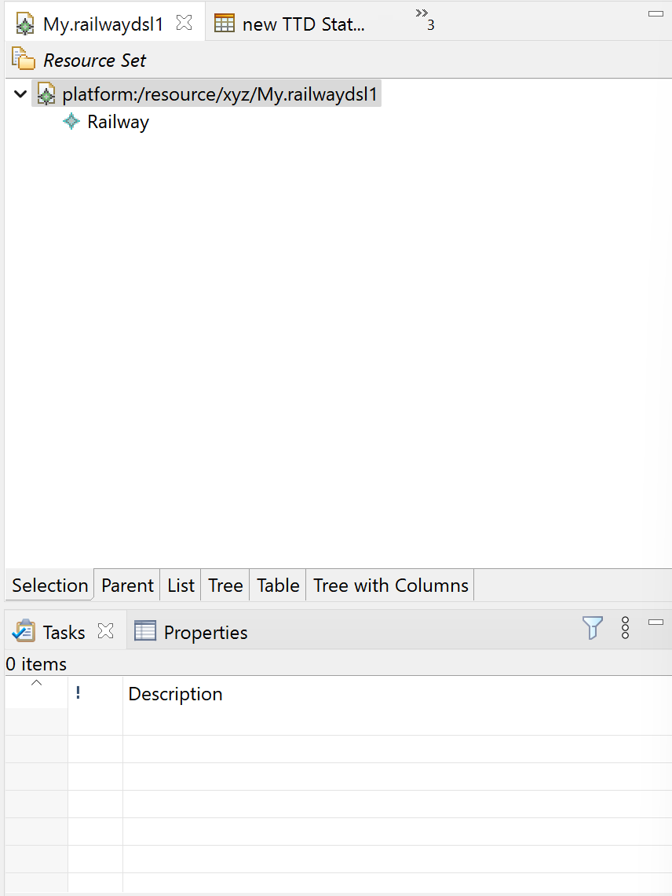
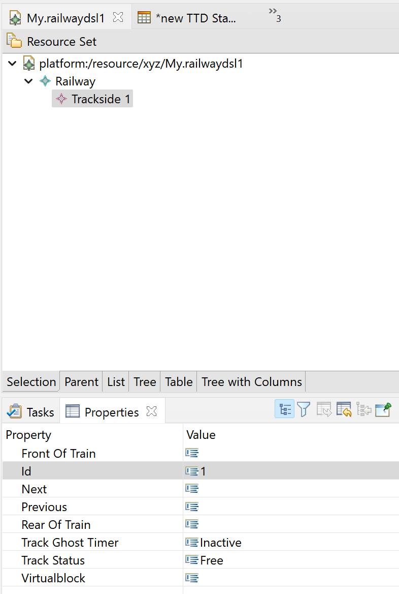
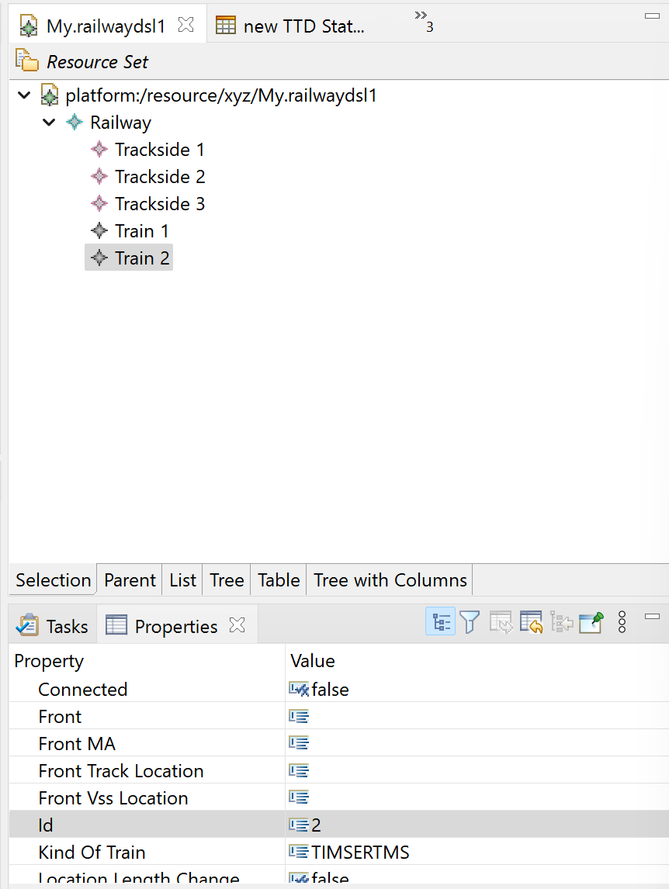
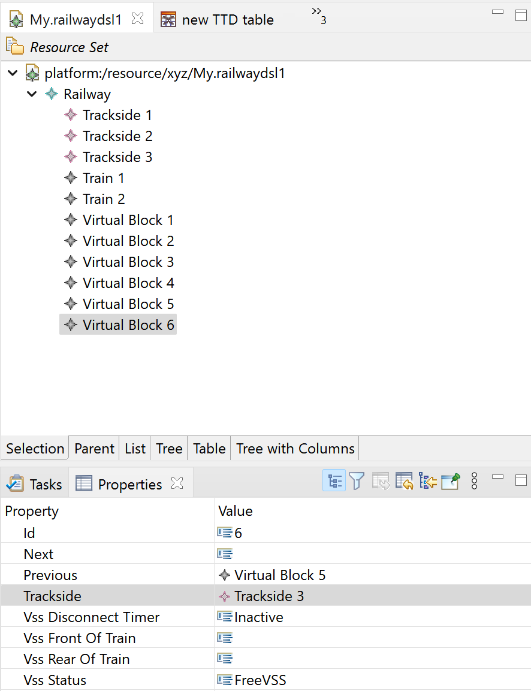
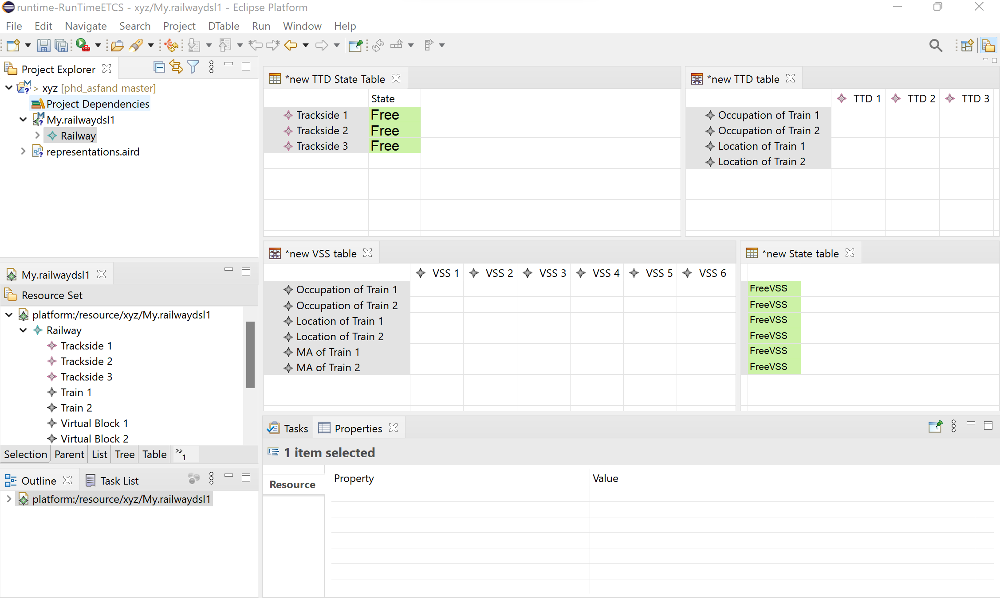
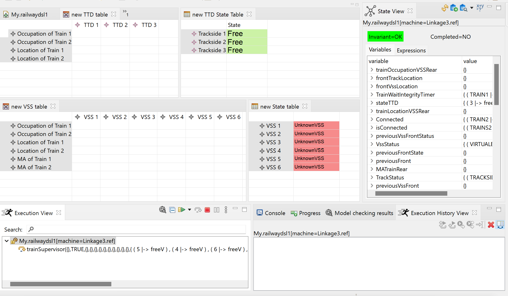
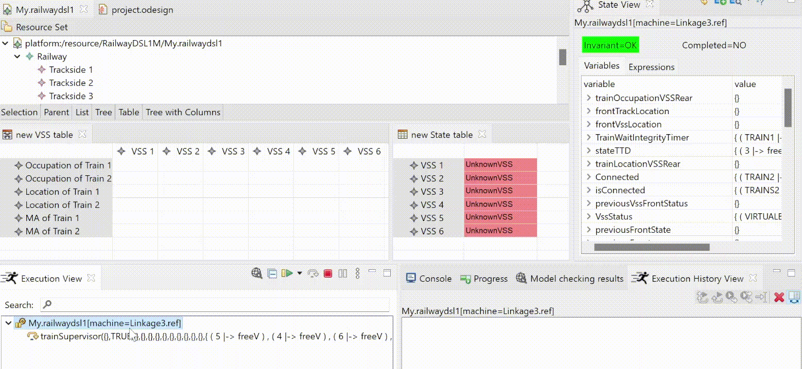

The ETCSLevel3 Sample contains the artifects used in our SEFM 2022 conference paper: An Iterative Formal Model-Driven Approach to Railway Systems Validation - A Case Study

1. Prerequits to use this project are ECLIPSE and MEEDUSE
(Option: You can animate the linkage machines without graphical animation in ProB -> goto folder Samples -> ETCSLevel3 -> model -> animation -> My ; and here you can open the Linkage0, Linkage1, Linkage2 and Linkage3. Note that file railwayDSL1.mch is the DSL machine contains all the DSL concepts from DSLv0 to DSLv3).

MEEDUSE Installation: Link: http://vasco.imag.fr/tools/meeduse/html/index.html

- Meeduse integrates the ProB tool within EMF-based frameworks like XText, Sirius, GMF. To use Meeduse:

Install the Eclipse Modelling Tools. Any recent distribution should work (The ETCSLevel3 project is built on ECLISPE Version: 2021-03 (4.19.0)). Link: https://www.eclipse.org/downloads/packages/release/2022-03/r/eclipse-modeling-tools

Launch your eclipse and install B4MSecure and Meeduse from the following update sites:
- B4MSecure: http://vasco.imag.fr/tools/b4msecure/updates/build
- Meeduse: http://vasco.imag.fr/tools/meeduse/updates/build

See the Eclipse User Guide for instructions on how to install software from update sites:
- https://help.eclipse.org/latest/index.jsp?topic=%2Forg.eclipse.platform.doc.user%2Ftasks%2Ftasks-129.htm&cp%3D0_3_17

2. Pull the https://github.com/meeduse/Samples/tree/main/ETCSLevel3 project from GIT

3. When all is set up and done then you are ready to use the resourcses from GIT in Eclipse.

- In Eclipse, click on File -> New -> Other -> Eclipse Modeling Framework, EMF Project -> Next -> (Give a name "abc") -> Next -> Ecore Model -> Next -> Browsw File System and then in Specs folder of ETCSLevel3 project  select railwayDSL1 Ecore Model (This is the DSL meta-model level 3 - called DSLv3 in paper, you can use this for animation of all the Linkages). Load it, click Next then select check & Finish.

- Now go to ETCSLevel3 GIT Folder then specs folder ->  copy all the files except railwayDSL1 Ecore Model and paste it to the "abc" eclipse project's model folder where railwayDSL1.ecore is already placed. 

- Generate the Edit and Editor: To do this, Go to  open the railwayDSL1.genmodel file from "abc" eclispe projects's model folder. When it is open, right click on the root RailwayDSL1 and generate all and you can see the edit, editor and test(Not required) projects generated in model explorer. 

- Uploading the Sirius Represenation: Click on File -> Import -> General-> Projects from Folder or Archive -> Next -> Directory: and you here you go inside Sirius folder of GIT repository, select the ertms_etcs.project.design folder and Finish. 

- Setting up the meta-model in Sirius Project: In the model explorer under the ertms_etcs.project.design project, open the description folder and double click the project.odesign. Once it is open, go to project folder -> MyViewpoint -> TTD table. Goto the properties of TTD table and click the meta-model tab where you can find a railwayDSL1 model source with a red cross (which mean  that it is invalid). Select it and click remove. Once it is removed, click on "Add from workspace" and in the prompted dialog, click on "abc" folder. Under the model folder, select the railwayDSL1.ecore and click Ok. Now save all (CTRL+S). 

Repeat the process which you did for TTD table; for all the tables:

-> MyViewpoint -> VSS table. Goto the properties of VSS table and click the meta-model tab where you can find a railwayDSL1 model source with a red cross (which mean  that it is invalid). Select it and click remove. Once it is removed, click on "Add from workspace" and in the prompted dialog, click on "abc" folder. Under the model folder, select the railwayDSL1.ecore and click Ok. Now save all.

-> MyViewpoint -> State table (which is VSS state Table). Goto the properties of State table and click the meta-model tab where you can find a railwayDSL1 model source with a red cross (which mean  that it is invalid). Select it and click remove. Once it is removed, click on "Add from workspace" and in the prompted dialog, click on "abc" folder. Under the model folder, select the railwayDSL1.ecore and click Ok. Now save all.

-> MyViewpoint -> TTD State table (which is TTD state Table). Goto the properties of TTD State table and click the meta-model tab where you can find a railwayDSL1 model source with a red cross (which mean  that it is invalid). Select it and click remove. Once it is removed, click on "Add from workspace" and in the prompted dialog, click on "abc" folder. Under the model folder, select the railwayDSL1.ecore and click Ok. Now save all.

- Now it is time to goto runtime eclipse: Right click in model explorer, then click on Run As-> Run Configurations. It will open the Run Configurations window. Now Right click on "Eclipse Application" Option on left side of window. And here you can select "New Configuration". Name it "RunTimeETCS" then click Apply and Run.
It will start a runtime eclipse. 

- In runtime eclispe, click on New -> Other -> Sirius -> Modeling project, Next -> give a project name: "xyz" and Ok Finish. 

- Now click on "xyz" folder in model explorer, click New -> Other -> Example EMF Model Creation Wizards and select the RailwayDSL1 Model and click Next.  Now you have My.railwaydsl1 in dialog box, put it in folder xyz and click next. Now it asks to set the root class in model object. Select Railway class and click Finish. 

- If you open the My.railwayDSL1 under the "xyz" folder in project explorer, you can see the model with a railway. 

- Setting up the representation: Double click on representation.aird and now you can find MyViewpoint (disabled) under the representations in aird editor. Select the MyViewpoint (disabled) and click Enable. Now your view point is enabled. Double Click on below TTD table (0) in aird editor. A window will open, select Railway and Finish. The default name is new TTD table, click Ok. Now Save (ctrl+s). The TTD tableis opened. Do the same process for all tables: VSS table, State Table and TTD State Table, double click on them. Select Railway and click Ok. Ctrl+S. Now you can see all of your tables but they are empty. 

- Now you will have an empty Railway model without any Trains, TTDs and VSSs. Double Click on My.railwayDSL1 in project explorer which open the model that can be seen like in below screenshot.

- Click on Railway -> New Child -> Trackside and set Id of Trackside to 1 in properties and ctrl+s. and your representation looks like as below screenshot.

- Add two more Tracksides (Set Ids to 2 and 3) and set Next of Trackside 2 to Trackside 3. And them Previous of Trackside to Trackside 1 and Ctrl+3. Now Add two trains: Click on Railway -> New Child -> Train and set their Ids to 1 and 2 respectively (By default their Kind is TIMSERTMS). and Ctrl+S. and now your model look like this.

- It is time to add the VSSs. Like Trackside, now add Virtual Block. Add 6 Virtual Blocks and set their Ids from 1 to 6. Also set their Previous and Next such that Virtual Block 1 next is 2, 2s next is 3, 3s is 4, 4s is 5 and 5s is 6. Ctrl+s.

-  Set the Tracksie of Virtual Blocks 1 and 2 to Trackside 1. Virtual Blocks 3 and 4 to Trackside 2. Virtual Blocks 5 and 6 to Trackside 3 (ctrl+s). and your model looks like in screenshot below:

Now arrange your Tables in a way shown in screenshot below:

 

- Now in Project explorer on left side of the eclispe application, under My.railwaydsl1 -> right click on Railway -> Execute Model -> and here you will see all the B machines. You have to select from Linkage0.ref, Linkage1.ref, Linkage2.ref and Linkage3.ref.

- Lets select th Linkage3. And you will get the prompted dialog box, you have the option to generate injected machine (you can click it if you want to generate the injected valued machine). Enter Finish and the it open the Meeduse Perspective. In below screenshot you can see the State View, Execution View and Execution History View from Meeduse alongside the tables. You can play with visualization using the operations in Execution view. 

 - You can also randomly animate the the model by clicking the green play button in the Execution View-> Random animation with invariant checking. Below is a GIF which shows the animation of the new VSS table and new State Table illustrating random animation of Linkage3. 

