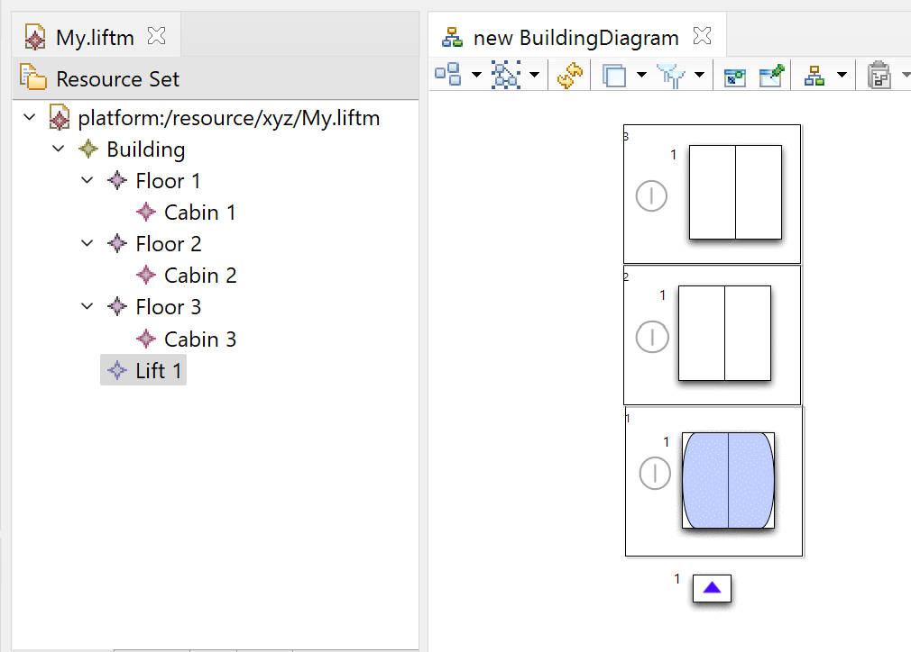

The Lift Sample contains the artifects used in our ICFEM 2022 conference paper: Visual Animation of B Specifications using Domain-Specific Languages

1. Prerequits to use this project are ECLIPSE and MEEDUSE

MEEDUSE Installation: Link: http://vasco.imag.fr/tools/meeduse/html/index.html

- Meeduse integrates the ProB tool within EMF-based frameworks like XText, Sirius, GMF. To use Meeduse:

Install the Eclipse Modelling Tools. Any recent distribution should work (The Lift project is built on ECLISPE Version: 2021-03 (4.19.0)). Link: https://www.eclipse.org/downloads/packages/release/2022-03/r/eclipse-modeling-tools

Launch your eclipse and install B4MSecure and Meeduse from the following update sites:
- B4MSecure: http://vasco.imag.fr/tools/b4msecure/updates/build
- Meeduse: http://vasco.imag.fr/tools/meeduse/updates/build

See the Eclipse User Guide for instructions on how to install software from update sites:
- https://help.eclipse.org/latest/index.jsp?topic=%2Forg.eclipse.platform.doc.user%2Ftasks%2Ftasks-129.htm&cp%3D0_3_17

2. Pull the https://github.com/meeduse/Samples/tree/main/Lift project from GIT

3. When all is set up and done then you are ready to use the resourcses from GIT in Eclipse.

- In Eclipse, click on File -> New -> Other -> Eclipse Modeling Framework, EMF Project -> Next -> (Give a name "abc") -> Next -> Ecore Model -> Next -> Browsw File System and then in Specs folder of Lift project choose an approach. In the folder of choosen approach, ByRefinement or BySynchronization, select liftM Ecore Model. Load it, click Next then select check & Finish.

- Now go to LIFT GIT Folder then specs folder -> open the approach folder: ByRefinement or BySynchronization, copy all the files except liftM Ecore Model and paste it to the "abc" eclipse project's model folder where liftM.ecore is already placed. 

- Generate the Edit and Editor: To do this, Go to  open the liftM.genmodel file from "abc" eclispe projects's model folder. When it is open, right click on the root liftM and generate all and you can see the edit, editor and test(Not required) projects generated in model explorer. 

- Uploading the Sirius Represenation: Click on File -> Import -> Projects from Folder or Archive -> Next -> Directory and you here you go inside Sirius folder of GIT repository, select the myLift2.project.design folder and Finish. 

- Setting up the meta-model in Sirius Project: In the model explorer under the myLift2.project.design project, open the description folder and double click the project.odesign. Once it is open, go to project folder -> MyViewpoint -> BuildingDiagram. Goto the properties of BuildingDiagram and click the meta-model tab where you can find a liftM model source with a red cross (which mean  that it is invalid). Select it and click remove. Once it is removed, click on "Add from workspace" and in the prompted dialog, click on "abc" folder. Under the model folder, select the liftM.ecore and click Ok. Now save all. 

- Now it is time to goto runtime eclipse: Right click in model explorer, then click on Run As-> Eclipse Application and it will start a runtime eclipse. 

- In runtime eclispe, click on New -> Other -> Sirius -> Modeling project, Next -> give a project name: "xyz" and Ok Finish. 

- Now click on "xyz" folder in model explorer, click New -> Other -> Example EMF Model Creation Wizards and select the LiftM Model and click Next.  Now you have My.liftM in dialog box, put it in folder xyz and click next. Now it asks to set the root class in model object. Select Building class and click Finish. 

- If you open the My.liftM under the "xyz" folder in model explorer, you can see the model with a building. 

- Setting up the representation: Double click on representation.aird and now you can find MyViewpoint (disabled) under the representations in aird editor. Select the MyViewpoint (disabled) and click Enable. Now your view point is enabled. Double Click on below BuildingDiagram (0) in aird editor. A window will open, select Building and Finish. The default name is New Buidling Diagram, click Ok. Now Save (ctrl+s).

- Now you will have an empty building without any floors and lift, which can be seen like in below screenshot.

- Click on Building -> Child -> Floor and set Floor Id to 1 in properties and ctrl+s. and your representation looks like as below screenshot.

- Add two more floors and arranage them like as in below screenshot. 

- Now click at building and add a child Lift and set the Id as Lift 1  and set also the position to Floor 1. 

- Now add a cabin to each floor by clicking on Floor -> New Child -> cabin and in properties of each cabin sets the belongsTo(property) to Lift 1. (Ctrl+s)

- Once the cabins are added, the representation will look like the below screenshot.

- You need to arrange the representation as following screenshot (Note: set the zoom level to 50% if your screen is smaller).

Once your model and representation are ready. Now right click on either model or representation, click on Execute Model -> Linkage_Refinement.ref / Linkage_Synchronization.ref and in the prompted dialog box, you have the option to generate injected machine (you can click it if you want to generate the injected valued machine). Enter Finish and the it open the Meeduse Perspective. You can play with visualization using the operations in execution view. You can also randomly animatie by clicking the green play button -> Random animation with invariant checking. Below is a GIF which shows the animation of the LIFT. 

