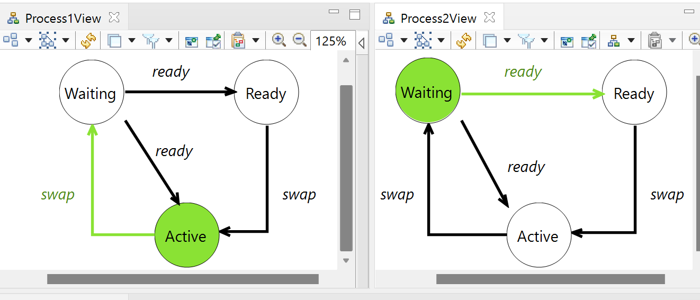

The Scheduler Sample contains the artifects used in our MODEVVA 2022 Workshop paper:Visual Animation of B Specifications using Executable DSLs

1. Prerequits to use this project are ECLIPSE and MEEDUSE

MEEDUSE Installation: Link: http://vasco.imag.fr/tools/meeduse/html/index.html

- Meeduse integrates the ProB tool within EMF-based frameworks like XText, Sirius, GMF. To use Meeduse:

Install the Eclipse Modelling Tools. Any recent distribution should work (The Lift project is built on ECLISPE Version: 2021-03 (4.19.0)). Link: https://www.eclipse.org/downloads/packages/release/2022-03/r/eclipse-modeling-tools

Launch your eclipse and install B4MSecure and Meeduse from the following update sites:
- B4MSecure: http://vasco.imag.fr/tools/b4msecure/updates/build
- Meeduse: http://vasco.imag.fr/tools/meeduse/updates/build

See the Eclipse User Guide for instructions on how to install software from update sites:
- https://help.eclipse.org/latest/index.jsp?topic=%2Forg.eclipse.platform.doc.user%2Ftasks%2Ftasks-129.htm&cp%3D0_3_17

2. Pull the https://github.com/meeduse/Samples/tree/main/Lift project from GIT

3. When all is set up and done then you are ready to use the resourcses from GIT in Eclipse.

- In Eclipse, click on File -> New -> Other -> Eclipse Modeling Framework, EMF Project -> Next -> (Give a name "abc") -> Next -> Ecore Model -> Next -> Browsw File System and then in Specs folder of Scheduler project and select schedulerDSL Ecore Model. Load it, click Next then select check & Finish.

- Now go to Scheduler GIT Folder then specs folder -> open the approach folder: copy all the files except schedulerDSL Ecore Model and paste it to the "abc" eclipse project's model folder where schedulerDSL.ecore is already placed. 

- Generate the Edit and Editor: To do this, Go to  open the schedulerDSL.genmodel file from "abc" eclispe projects's model folder. When it is open, right click on the root schedulerDSL and generate all and you can see the edit, editor and test(Not required) projects generated in model explorer. 

- Uploading the Sirius Represenation: Click on File -> Import -> Projects from Folder or Archive -> Next -> Directory and you here you go inside Sirius folder of GIT repository, select the myScheduler.project.design folder and Finish. 

- Setting up the meta-model in Sirius Project: In the model explorer under the myScheduler.project.design project, open the description folder and double click the project.odesign. Once it is open, go to project folder -> MyViewpoint -> ProcessView. Goto the properties of ProcessView and click the meta-model tab where you can find a schedulerDSL model source with a red cross (which mean  that it is invalid). Select it and click remove. Once it is removed, click on "Add from workspace" and in the prompted dialog, click on "abc" folder. Under the model folder, select the schedulerDSL.ecore and click Ok. Now save all. 

- Now it is time to goto runtime eclipse: Right click in model explorer, then click on Run As-> Run Configurations. It will open the Run Configurations window. Now Right click on "Eclipse Application" Option on left side of window. And here you can select "New Configuration". Name it "RunTimeScheduler" then click Apply and Run. It will start a runtime eclipse.
 

- In runtime eclispe, click on New -> Other -> Sirius -> Modeling project, Next -> give a project name: "xyz" and Ok Finish. 

- Now click on "xyz" folder in model explorer, click New -> Other -> Example EMF Model Creation Wizards and select the SchedulerDSL Model and click Next.  Now you have My.schedulerdsl in dialog box, put it in folder xyz and click next. Now it asks to set the root class in model object. Select Scheduler Class class and click Finish. 

- If you open the My.schedulerdsl under the "xyz" folder in model explorer, you can see the model with a Scheduler Class. 

- Right click on Scheduler Class -> New Child -> Process Class (Set its Number to 1 in property view). Same like create another process and set its number to 2. 

- Setting up the representation: Double click on representation.aird and now you can find MyViewpoint (disabled) under the representations in aird editor. Select the MyViewpoint (disabled) and click Enable. Now your view point is enabled. Double Click on below ProcessView (0) in aird editor. A window will open, select 1st Process Class and Finish. The default name is New ProcessView, Set it to 'Process1View' click Ok. Now Save (ctrl+s). Now in Model exploerer, right click on the 2nd Process -> New Representation -> new ProcessView , Now name it Process2View Ok. Now Save (ctrl+s). 
- Arrange it like this in below screeshot and save it: 

- Once your model and representation are ready. Now right click on Scheduler Class in Model Explorer , click on Execute Model -> LinkageScheduler.ref and in the prompted dialog box, you have the option to generate injected machine (you can click it if you want to generate the injected valued machine). Enter Finish and the it open the Meeduse Perspective. You can play with visualization using the operations in execution view. 